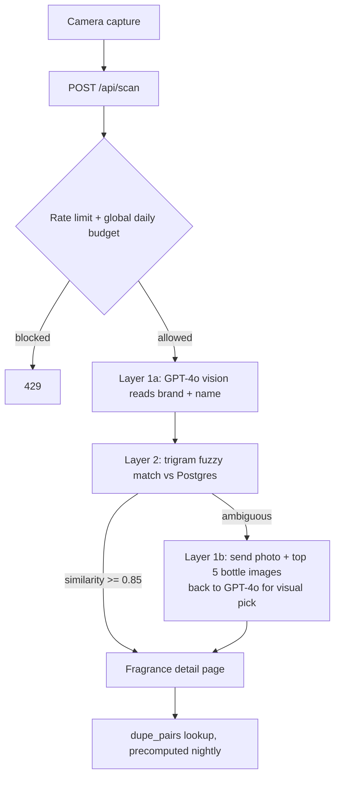

# Spritz

**Point your camera at a fragrance bottle and find out what's actually in it.** Notes, perfumer, how long it lasts, when to wear it, the story of the house that made it. One page, built for the moment you're standing there holding the thing.

**Live:** [spritzofficial.app](https://spritzofficial.app) · **Code:** [github.com/knightjek23/spritz](https://github.com/knightjek23/spritz)

**My role:** Product, design, architecture, and AI direction. Solo build.

**Stack:** Next.js 14 · Supabase (Postgres + pgvector) · Clerk · Stripe · GPT-4o vision · Vercel

**Timeline:** Spec written April 22, 2026. First commit May 18. Launched and still shipping in August.

---

## The problem

Fragrance people spend a weirdly large amount of time on one repeated task: picking up a bottle and trying to work out what it actually is. What's in it, how long it lasts, who composed it, whether the hype is real.

Today that means screenshotting the bottle, typing the name into Fragrantica's desktop wiki on your phone, scrolling past ads, and stitching the perfumer credit, the longevity scores, the house history, and the community verdict together across four or five tabs. It's a mobile-hostile workflow for a community that lives on TikTok and Reddit, which is to say on their phones.

I wanted that to collapse into one action. Point camera, know the bottle. Not "here's a cheaper one you should buy instead," which is what every other app in the space does. Just: here's everything worth knowing about the one in your hand.

## What I decided before I wrote a single prompt

The PRD came first, and most of it is a list of things I wasn't going to build.

- **Not a dupe finder.** The original braindump was a "find the cheaper alternative" app. I killed that framing in April. The similarity engine survived, but it's a collapsed, opt-in section near the bottom of the detail page with no price comparison and no buy buttons on the alternatives. More on why below.
- **No social layer, no taste profile.** Both are obvious v2 features and both need data I don't have on day one.
- **PWA, not native.** Shipping to an app store in v1 would have doubled the surface area before I knew whether anyone wanted the thing.
- **Top 10,000 fragrances, not a complete catalog.** That covers roughly everything a normal person owns. The long tail gets filled in reactively.
- **The data layer has to be swappable.** I bootstrapped the catalog by scraping, which means the source is a liability, not a foundation. Nothing in the app is allowed to depend on where the data came from.
- **Two-layer scanning, and no bottle-shape recognition.** I ruled shape matching out in the spec before anyone could build it. Bottles look like each other and flankers look identical to their originals.

That last set of decisions is the part that actually shaped the build. A constraint is only useful if it rules something out.

## Architecture

**Next.js 14 on Vercel** because the product is a set of shareable, crawlable pages and I wanted server rendering without running servers. **Supabase** for Postgres plus row-level security, so authorization lives in the database instead of scattered through route handlers I'd have to keep re-verifying. **Clerk** for auth because session handling is exactly the kind of thing I don't want in my own codebase.

Three decisions worth naming, each with the thing I said no to:

**Scanning is OCR plus text matching, not image recognition.** GPT-4o reads the label, then a Postgres trigram search finds the fragrance. I rejected pure visual matching because Sauvage and Sauvage Elixir are the same bottle in different colors, and no embedding model saves you there. What I added later is a third stage that only fires when the text match is ambiguous: send the user's photo plus the top five candidate bottle images back to the model and let it pick. Catches the cap and contour signals OCR misses, costs three to six extra seconds, and only runs when it has to.

**Similarity is precomputed, not scored at request time.** The engine is a weighted blend: 70% cosine on the note vector, 20% Jaccard on family tags, 10% on season tags. Scoring 10,000 fragrances against each other per page load would be absurd, so a nightly job writes the top 50 per fragrance into a `dupe_pairs` table and the page just reads rows.

**Rate limiting runs on Postgres, not Redis.** Every scan already writes a row to `scan_events` for the accuracy metric, so counting today's rows per user and per hashed IP gets a limiter that works across serverless instances with no new infrastructure. Wrong answer at scale, right answer at zero users. The file says to swap it for Upstash if query volume ever matters, which I'd rather leave written down than pretend I made a permanent decision.

## How I directed the AI

The PRD is the source of truth and the code cites it. Files open with comments like `// Scan rate limiting. PRD §7.` and the dupe engine names the section its formula comes from. That's not decoration. When a build runs for three months the thing that kills you is drift, and a numbered spec the implementation points back to is the cheapest anchor I've found. If a file can't name the section it's implementing, that's a signal I never actually decided what it was for.

Everything credential-gated became a runbook instead of a prompt. `SETUP.md`, `LAUNCH_RUNBOOK.md`, `STRIPE_SETUP.md`, `APP_STORE_LAUNCH.md`. The rule: if a step needs my hands on a dashboard, it gets written down as an ordered procedure with the failure modes attached, and it does not get faked in code.

I was deliberate about what stayed out. The scraper is a separate package with its own copy of the few helpers it needs, because cross-package imports broke at runtime and because I never want the scraper to become load-bearing. When I scaffolded the native app track, I kept the RevenueCat purchase code out of the web build entirely and parked it as code blocks in the runbook, since a native-only import in the Next.js tree would break the Vercel deploy for a feature that doesn't even run there.

## What I caught and changed

| What came back | Why it was wrong | What I did |
|---|---|---|
| An `onClick` handler inside a Server Component on `/family/[slug]` | React can't serialize functions across the server boundary, so it 500s at request time. Vercel returns a digest hash and nothing useful client-side. Production was broken and the browser told me nothing. | Fixed the component, then wrote `scripts/check-server-onclick.mjs` and wired it to `prebuild`. It walks `app/` and `components/`, decides server vs client from the directive, and fails the build if a server file contains `onClick`. It can't reach production again. |
| A rate limiter that failed open | On any database error it returned "allowed." The scan endpoint is public by design and each call costs real money in OpenAI spend, so an attacker who could induce DB errors got uncapped spend on my card. | Fail closed for anonymous requests, fail open for signed-in ones since they're already capped by account. Added a global daily scan ceiling on top so IP rotation can't route around it, and set a spend limit in the OpenAI dashboard as a backstop. |
| Em dashes everywhere | They're in the generated UI copy, the editorial content, and the output of my own AI features. It's the single most obvious tell that a human didn't write something, and it was leaking into the product. | Swept them out of the UI copy and the markdown, added the rule to the system prompts for the consensus and dupe generators, and then wrote a stripper function anyway because the model does it regardless of what you tell it. The comment in the file says exactly that. |
| A scraper import path that silently destroyed a backfill | The full parse-and-upload pipeline rewrites `popularity_rank` for every row from queue order. I'd spent a whole run computing those ranks with a model. Adding three fragrances the obvious way would have flattened all 7,100 of them. | Wrote a surgical importer that matches on the source URL, updates in place, and never touches the popularity columns. |
| Own / Tried / Wishlist buttons that didn't work, and a Pro upsell with no unlock flow | Found in the first moderated user test, not by me and not by any audit. The participant couldn't complete the save task at all, and she read the entire Pro pitch and then had nowhere to click. | Both went to the top of the bug list before I ran another session. Burning a second participant on the same dead end costs you everything they would have said after it. |

I also ran a three-way audit of the codebase before launch, reading security, performance, and SEO in parallel. It found things I'd genuinely missed, including a table added in a later migration that never got row-level security turned on while every table in the initial schema had it. That one is worth saying out loud: the failure wasn't that the code was bad, it's that a rule established in migration 0001 quietly stopped being enforced by migration 0013, and nothing in my process was checking.

And the part that makes the rest of this honest: plenty of it I kept. The scoring math, the Zod validation on the scan payload, the trigram search functions, most of the component layer. When the first pass was better than what I'd have written cold, I left it alone.

## Design

I threw out the entire visual system halfway through. The April direction was the current consumer-startup look: near-white base, electric blue, acid yellow. It was fine, and it looked like everything else. Fragrance trades on craft and heritage, and a landing page styled like a fintech dashboard was fighting the product.

The replacement is Playfair Display over Roboto on a warm cream base, deep forest emerald for brand and CTAs, brass for saved states, burgundy for errors. Two things about the swap I'd defend. I lifted the surface color from `#E8E1D4` to `#F0EADE` specifically so the secondary text tone clears WCAG AA at 4.55:1, because the nicer beige failed and I'm not shipping a palette I have to apologize for. And I left the old token names in the Tailwind config as aliases pointing at the new values, so any component I hadn't swept yet still rendered something sensible instead of falling back to transparent. A rename across thirty-two components breaks quietly, in the corner you forgot about.

The other design change came out of user testing. My first participant was asked what she expected to find that wasn't there, and she said "an encyclopedia of different perfumes to browse and learn about." That is the product's actual positioning, and it was on screen in front of her the whole session. The home page was reading as a scan tool and burying the thing that mattered. I rewrote the hero from "Know what you're wearing" to "Every fragrance, broken down," and demoted scanning to one of three entry points alongside search and browse.

## Where it landed

Live at spritzofficial.app and launched. The catalog is around 7,100 fragrances, each with notes, family and season tags, longevity and sillage, and a popularity rank, plus hand-written editorial on twelve of the biggest houses. Scan, search, browse by house, family and note, save to Own / Tried / Wishlist, and a Pro tier at $4.99 monthly, $29.99 annual, or $89 once. Twenty-one migrations, fifteen API routes, thirty-two components, 124 commits between May 18 and the first week of August.

`[TODO: users, scans, or conversion since launch? Only what you actually measured.]`

The native track is scaffolded but not shipped: a Capacitor shell and a RevenueCat webhook running parallel to Stripe, both converging on the same entitlement flag so the paid state doesn't fork.

## What I'd do differently

**I shipped the free trial on the wrong plan and had to reverse it.** A seven-day trial on the annual plan converts into a surprise $29.99 charge, which is a refund request and a bad review wearing a growth tactic's clothing. I moved it to monthly, where the worst case if someone forgets is $4.99. It was the right call and I should have made it before it was live.

**I hand-rolled the Supabase `Database` type instead of generating it.** It seemed harmless at the start. It's cost me real time twice now, because a type that doesn't match the schema doesn't fail loudly, it just resolves your query to `never` and lets you find out later. That's the debt I knowingly took on and it's still there.

**One user test is not user testing.** The n=1 session was the highest-value hour of the whole project and it also told me something I'm still not sure about: she'd pay $5 a month, and the thing she'd pay for was dupes and whatever's trending on TikTok, which is the exact positioning I deliberately walked away from. I split the difference by adding a trending surface and moving dupes higher in the page, but I don't actually know yet whether the encyclopedia framing or the dupe framing is the one that converts. Two more sessions would tell me. Two hundred users would tell me better.

---

## Gaps

- **`[TODO: launch numbers]`** in Where it landed. Anything measured since launch: signups, scans, free-to-Pro conversion, scan accuracy from `scan_events`. If nothing's measured yet, I'll cut the line rather than soften it.
- **Screenshots.** There's a `screenshots/` directory with mobile, desktop, signed-in and signed-out captures. Tell me which three or four you want and where they go, and I'll place them in Design and the Hero.
- **The committed service-role key.** The audit found a live Supabase key in `.env.example` in public git history, and the rotation is on your runbook. You didn't pick it as an item and I left it out. It's arguably the strongest entry in "what I caught," since it's a real production security incident with a documented fix path, but it's also the one that costs the most to admit. Your call.
- **The n=1 dupe tension.** I wrote the ending as an open question. If you've since decided which framing wins, that's a better ending than the honest shrug.
